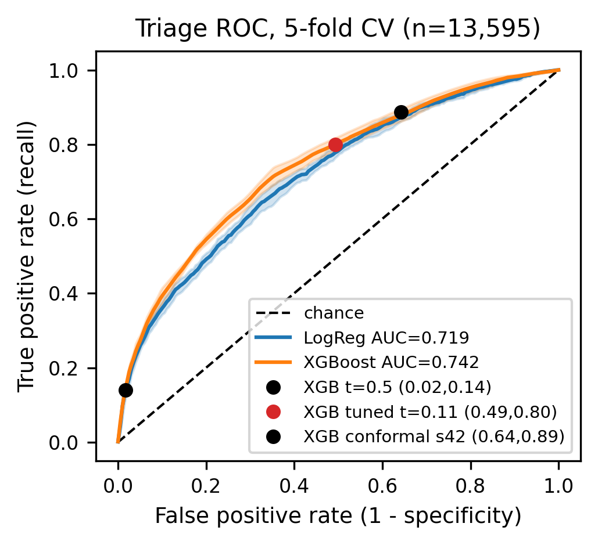
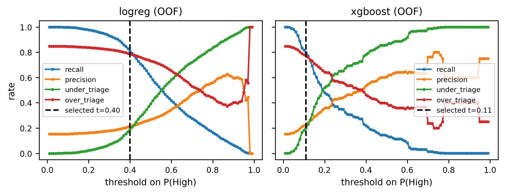
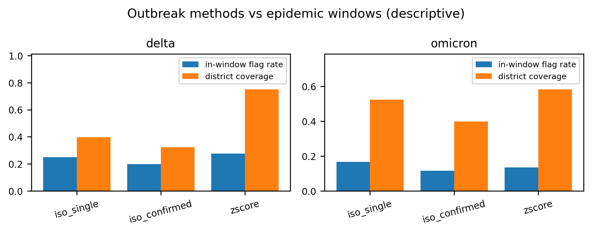

<!-- GENERATED by paper/export_md.py from main.tex + paper_numbers.json + main.bbl. DO NOT EDIT BY HAND. -->

# Real-Data Machine Learning for Telemedicine Triage and Outbreak Surveillance

**Author One, Author Two** — Placeholder Department, Placeholder Institute, City, India, {author.one, author.two}@example.com

## Abstract

Telemedicine platforms face two simultaneous decisions: which individual patients can be managed remotely and which require urgent escalation, and whether population-level signals indicate a developing outbreak. We evaluate a data-science layer built exclusively on public, real-world data: the CDC NHAMCS 2019 emergency department survey (13,595 analysis encounters), the covid19india district-level archive (126,712 district-weeks across 840 districts), and a Kaggle pharmaceutical sales series (69 months). For triage, a calibrated XGBoost reaches cross-validated AUC 0.742 versus 0.719 for a logistic baseline. Cross-fitted threshold selection cuts under-triage from 85.9% to 17.2% at FPR 0.545, and a PAC split-conformal rule raises mean recall over 200 splits to 0.900, keeping below-target splits to 3.5% (≤δ) versus 12.5% for the marginal rule; precision is 0.191 at 0.152 prevalence. For surveillance, an IsolationForest at a fixed 5% alert budget enriches the Delta wave 7.0× over background with a median lead of 2 weeks, reported descriptively since no labeled outbreak ground truth exists. No synthetic data is used; all code and seeds are released for reproduction.

**Keywords:** machine learning, telemedicine, clinical triage, conformal prediction, outbreak surveillance, interpretable machine learning.

## Introduction

Telemedicine services in resource-limited settings routinely carry two
statistical workloads at once. At the patient level, an intake stream of voice
transcripts and spot vital signs must be sorted into cases that a remote
clinician can safely manage and cases that demand in-person escalation; missing
an urgent case (under-triage) is a safety event, while over-triage consumes
scarce clinician time. At the population level, the same platform sits on a
growing archive of aggregated case counts, which can in principle provide
early warning of local outbreaks before clinicians notice a pattern in
individual visits. Both workloads are prediction problems, but they are
severely differently supervised: individual dispositions are recorded, whereas
district-level outbreak "truth" is not.

This paper evaluates the data-science layer of a rural telemedicine platform
against that asymmetry, using only public real-world datasets. Our first
module, patient-level triage, is built and benchmarked on the CDC NHAMCS 2019
emergency department (ED) survey [1], which carries vitals,
reason-for-visit codes, and recorded triage acuity for 19,481 raw visits. Our
second module, population-level surveillance, is built on the open
covid19india district time-series archive [2] covering
840 Indian districts. A supplementary module forecasts monthly
pharmaceutical demand from a public Kaggle point-of-sale series
(Zdravković [3]). Together they mirror the
architecture of the deployed platform (Fig. 1) while keeping
every evaluation number traceable to a committed artifact; a deterministic
fail-closed pipeline regenerates everything from raw files (no synthetic
data; seed-42 reruns byte-identical).

The paper makes three contributions:

- A safety-first operating-point analysis for triage in which
cross-fitted threshold selection (rather than model surgery) cuts
under-triage from 85.9% down to 17.2% while holding FPR
at 0.545, with an abstention band that routes low-confidence
predictions to a physician.
- A calibration-and-guarantee study: isotonic calibration of an ordinary
booster beats a constant predictor on out-of-fold Brier (0.113 vs
0.129), and a PAC split-conformal rule keeps below-target splits to
3.5% across 200 randomized splits (12.5% for the
marginal rule), quantifying exactly which guarantee holds.
- A label-free outbreak evaluation design that scores detectors by
empirical wave enrichment under a fixed alert budget rather than by invented
precision/recall labels, showing 7.0× Delta-wave
concentration for single-week isolation flags.

Sections II–V cover related work, data
and protocols, results, and limitations, including the US-to-India transfer
gap.

## Related Work

*Clinical early-warning scores.* The National Early Warning Score
NEWS2 [4, 5] is the standard vitals-only
acuity rule and the natural baseline for any triage model; we implement it as
a direct comparator.

*Gradient boosting for clinical prediction.* XGBoost [6]
and LightGBM [7] are the de facto tabular learners;
scikit-learn [8] supplies the linear baseline. Our
contribution is not a new learner but an operating-point and calibration
treatment of an ordinary boosted model under explicit asymmetric cost.

*Distribution-free uncertainty.* Conformal
prediction [9] and its modern
tutorials [10] give finite-sample coverage
statements under exchangeability. We use the split-conformal construction to
control sensitivity rather than set size, and we report the finite-sample
behavior across random splits because the textbook guarantee is marginal.

*Interpretability.* SHAP [11] attributions audit
whether the model attends to clinically plausible vitals and reason-for-visit
patterns.

*Outbreak detection without labels.* Frequency-threshold and
scan-statistic detectors predate machine learning, and open dashboards such as
OpenDengue [12] illustrate that curated public
outbreak labels are rare. We therefore evaluate detectors descriptively
against wave windows rather than against fabricated ground truth.

*Demand forecasting.* Seasonal-naive and
Holt-Winters [13] baselines are reported alongside
LightGBM precisely because complex models do not automatically win on short
monthly series.

## Data and Methods

### Datasets

*Triage (NHAMCS 2019 ED).* The National Hospital Ambulatory Medical Care
Survey 2019 emergency department file [1] is a US
public-domain, de-identified survey. Restricting to records with a valid
recorded triage level yields 13,595 analysis encounters from 19,481
raw records, with high-acuity prevalence 0.152. The target label marks
encounters recorded as emergent or urgent (nurse-assigned registration
acuity, the escalation-worthy class under the platform's routing
policy). Features are age, sex, six vital signs
(temperature, pulse, respiratory rate, systolic and diastolic pressure, oxygen
saturation), pain scale, and dummy indicators for the 20 most frequent
reason-for-visit codes decoded with official NCHS labels; missing vitals are
median-imputed inside each training fold. Cohort medians and dataset extents
are summarized in the supplementary cohort table (repository artifact
`paper_T7_cohort`).

*Outbreak (covid19india archive).* The static district-level
archive [2] spans 2020-04-26 to 2023-08-22 and is
resampled to 126,712 district-weeks over 840 state-qualified
districts. It contains reported case counts only: no outbreak labels exist at
district-week resolution.

*Supplementary demand (Kaggle pharma sales).* A monthly point-of-sale
series of eight ATC drug groups [3] (CC BY-NC 4.0)
contributes 69 complete months; a partial collection month is excluded
by rule, and the final 12 months form the holdout.

### Triage model and operating rule

Six candidate pipelines are trained under a shared 5-fold stratified protocol
(seed 42): a class-weighted logistic regression with standardization (the
baseline), class-weighted and unweighted XGBoost [6]
(`n_estimators`=200, depth 6, learning rate 0.1,
`scale_pos_weight` computed from training folds), and the unweighted
booster wrapped in isotonic or Platt calibration, all behind a median imputer
using scikit-learn [8]. The primary model is fixed by
a pre-declared rule: lowest 5-fold out-of-fold Brier among the calibrated
candidates, ties broken toward isotonic — which selects unweighted XGBoost
+ isotonic (Brier 0.1128 versus 0.1135 for Platt).
Calibration and unweighting both matter: the class-weighted predecessor
distorts probabilities (Brier 0.165) and reaches only
0.732 AUC versus 0.742. Under-triage is defined as
1-recall on the high-acuity class.

Rather than accept the default 0.5 threshold, we select the operating point
from the out-of-fold probability sweep as the threshold with maximum precision
among those whose recall reaches at least 0.80, ties broken toward the higher
threshold; this yields t=0.11 for the pooled sweep. Because selecting on
the same folds flatters the result, we also report a nested cross-fitted
estimate: each outer fold re-selects its threshold on the other four folds
only, giving thresholds 0.09–0.1. A physician-abstention band
routes any case whose maximum class probability falls below 0.60 (i.e.,
calibrated high-acuity probability in (0.4, 0.6)) to human review
regardless of threshold; the band bounds indecision near the decision
boundary, not confident errors far below it. Threshold tuning moves the model
along its ROC curve; it does not change AUC.

**Table I. Triage model comparison, 5-fold cross-validation (t=0.5, seed 42), with out-of-fold Brier scores. The constant row predicts each training fold's prevalence; it is the Brier reference the calibrated primary model must beat.**

| Model | AUC | Recall | Precision | F1 | Under-triage | Brier | Data Source |
| --- | --- | --- | --- | --- | --- | --- | --- |
| Logistic Regression (baseline) | 0.719 | 0.609 | 0.269 | 0.373 | 0.391 | 0.209 | CDC NHAMCS 2019 ED |
| XGBoost (class-weighted) | 0.732 | 0.513 | 0.334 | 0.405 | 0.487 | 0.165 | CDC NHAMCS 2019 ED |
| XGBoost (unweighted) | 0.743 | 0.188 | 0.571 | 0.283 | 0.812 | 0.113 | CDC NHAMCS 2019 ED |
| XGBoost (unweighted + isotonic) | 0.742 | 0.141 | 0.606 | 0.227 | 0.859 | 0.113 | CDC NHAMCS 2019 ED |
| XGBoost (unweighted + Platt) | 0.743 | 0.158 | 0.593 | 0.249 | 0.842 | 0.113 | CDC NHAMCS 2019 ED |
| Constant (train prevalence) | 0.5 | 0.0 | 0.0 | 0.0 | 1.0 | 0.129 | CDC NHAMCS 2019 ED |

**Data source:** CDC NHAMCS 2019 ED (n=13,595).

### Split-conformal recall control

To target a sensitivity level with a finite-sample statement, we wrap the
trained classifier in split-conformal calibration [9, 10]: each replicate draws stratified 60/20/20
train/calibration/test splits; on the calibration set the decision threshold
is set from the predicted probabilities of the positive class at error level
α=0.15, i.e. a nominal recall of 1-α=0.85. The textbook
choice takes the ⌊α(n+1)⌋-th order statistic, whose
guarantee is *marginal*: it constrains the average over calibration
draws, not the share of individual splits that miss the target. We therefore
also report a PAC (probably approximately correct) variant that picks the
largest rank k for which the Beta(n{+}1{-}k,\,k) CDF at 1-α is at
most δ=0.1: a lower rank lowers the threshold and raises recall,
buying a bound in which at most 10% of splits fall below
target. We repeat over 200 random seeds (0–199) under both rules and
report the distribution of test recall, the implied thresholds, and
abstention rates. The protocol uses train-fold statistics only. As a clinical
reference we also evaluate NEWS2 [4, 5] computed
from the vitals columns alone.

### Outbreak surveillance under an alert budget

District-week counts are converted to weekly features and fed to an
IsolationForest with contamination 0.05, which fixes the alert budget at 5%
of district-weeks by construction; we never present that fraction as a
detected-outbreak rate. Two variants (single-week flags and
confirmation-filtered flags) are compared against a rolling 4-week z-score
baseline. Because no gold labels exist, evaluation
is *descriptive enrichment*: for the Delta (2021-04-01–2021-06-30) and
Omicron wave windows we report the flag rate inside the window versus the
background flag rate outside it, district coverage, and median lead relative
to window start, mirroring the alert-budget evaluation style of public
health surveillance practice.

### Reproducibility discipline

All pipelines fail closed: a missing raw file aborts the script with its
download URL instead of substituting synthetic data. Seed-42 reruns
reproduce every committed CSV and JSON byte-identically, and all paper
numbers are regenerated from `paper_numbers.json`.

## Results

### Triage discrimination and interpretability

Table I compares the candidates at the default
threshold, with out-of-fold Brier as the calibration view: the primary
calibrated model reaches 0.113 against 0.129 for a constant
predictor (the reference it must beat), while the class-weighted variant sits
at 0.165. On discrimination the primary reaches AUC 0.742
(95% CI 0.728–0.751) versus 0.719
(0.708–0.731) for logistic regression, and the paired
bootstrap difference interval 0.012–0.031 excludes zero. At
t=0.5, however, it misses 0.859 of high-acuity patients — an
unacceptable operating point for triage despite a low false-positive rate of
only 0.016. Fig. 2 shows the ROC curves with the
default, tuned, and conformal operating points marked: the entire useful
operating region lies well below t=0.5. SHAP attributions
(supplementary figure, repository artifact `paper_fig2_shap`)
confirm the model leans on age, pulse, respiratory rate, and pain score, with
reason-for-visit codes contributing clinically recognizable splits such as
chest pain and shortness of breath.

### Operating-point selection

Table II and Fig. 3 show the central
triage result. On the pooled sweep, lowering the threshold from 0.50 to
0.11 cuts under-triage from 85.9% to 20.0% (recall
0.8, FPR 0.493) at the cost of precision (0.226) and
abstention 0.042. The nested cross-fitted estimate — the conservative
one to quote, since each outer fold tunes without seeing its own test labels
—
puts recall at 0.829, precision 0.214, FPR 0.545 and
under-triage 17.2% across thresholds 0.09–0.1,
confirming the trade survives out-of-fold tuning. This is the standard
sensitivity-first trade of emergency triage, reported on both axes so the
exchange is visible. The abstention band defers 0.042 of cases to a
physician, bounding model indecision near the boundary — it does not bound
the false-high risk of confidently low predictions below the band.

**Table II. Operating points for the triage module: default, tuned (pre-declared rule: max precision among thresholds with OOF recall ≥ 0.80), the nested cross-fitted evaluation, and split-conformal (seed 42).**

| Operating point | Threshold | Recall | Precision | FPR | Under-triage | Abstention | AUC | Data Source |
| --- | --- | --- | --- | --- | --- | --- | --- | --- |
| Primary, t=0.50 (pooled OOF) | 0.5 | 0.141 | 0.605 | 0.016 | 0.859 | 0.042 | 0.74 | CDC NHAMCS 2019 ED |
| Primary, tuned (pooled OOF) | 0.11 | 0.8 | 0.226 | 0.493 | 0.2 | 0.042 | 0.74 | CDC NHAMCS 2019 ED |
| Primary, cross-fitted (headline) | 0.096 [0.09, 0.10] | 0.829 | 0.214 | 0.545 | 0.172 | 0.042 | 0.74 | CDC NHAMCS 2019 ED |
| LogReg, tuned (pooled OOF) | 0.4 | 0.811 | 0.214 | 0.536 | 0.189 | 0.394 | 0.719 | CDC NHAMCS 2019 ED |
| Primary, conformal, seed-42 test | 0.099 | 0.886 | 0.199 | 0.643 | 0.114 | 0.036 | 0.755 | CDC NHAMCS 2019 ED |

**Data source:** CDC NHAMCS 2019 ED (n=13,595). AUC is threshold-independent; OOF = out-of-fold; cross-fitted rows tune on inner folds and evaluate on held-out outer folds.

### Conformal recall control

Table III sweeps the conformal error level over
200 splits per setting under both rules. At α=0.15 the
marginal rule reaches mean test recall 0.884 (SD 0.033) at mean
precision 0.196, yet 12.5% of the splits miss the 0.85 mark
(Fig. 4); the finite-sample statement is marginal over
calibration draws, not a per-deployment promise, and we state it that way.
The PAC rule at δ=0.1 changes the accounting: mean recall rises
to 0.900 (SD 0.030) and only 3.5% of splits fall below
target — within the δ budget — at mean precision 0.191 and
mean threshold 0.089 (versus 0.094 for the marginal rule). The
cost is a lower threshold and hence more flags; mean abstention (0.043)
is stable across seeds.

**Table III. Split-conformal recall control over 200 random 60/20/20 splits (primary XGBoost+isotonic; calibration quantile on positives). Marginal: textbook k=⌊α(n+1)⌋ rule, average guarantee. PAC: Beta order-statistic rank at δ=0.1, bounding the below-target share per split.**

| alpha (miss target) | Rule | Mean recall | SD | Frac. below 1-α | Mean precision | Data Source |
| --- | --- | --- | --- | --- | --- | --- |
| 0.05 | marginal | 0.966 | 0.015 | 0.145 | 0.169 | CDC NHAMCS 2019 ED (n=13,595) |
| 0.05 | PAC (δ=0.1) | 0.976 | 0.013 | 0.03 | 0.164 | CDC NHAMCS 2019 ED (n=13,595) |
| 0.1 | marginal | 0.924 | 0.023 | 0.155 | 0.183 | CDC NHAMCS 2019 ED (n=13,595) |
| 0.1 | PAC (δ=0.1) | 0.938 | 0.021 | 0.03 | 0.179 | CDC NHAMCS 2019 ED (n=13,595) |
| 0.15 | marginal | 0.884 | 0.033 | 0.125 | 0.196 | CDC NHAMCS 2019 ED (n=13,595) |
| 0.15 | PAC (δ=0.1) | 0.9 | 0.03 | 0.035 | 0.191 | CDC NHAMCS 2019 ED (n=13,595) |
| 0.2 | marginal | 0.832 | 0.038 | 0.22 | 0.212 | CDC NHAMCS 2019 ED (n=13,595) |
| 0.2 | PAC (δ=0.1) | 0.858 | 0.038 | 0.06 | 0.204 | CDC NHAMCS 2019 ED (n=13,595) |
| 0.3 | marginal | 0.737 | 0.043 | 0.175 | 0.243 | CDC NHAMCS 2019 ED (n=13,595) |
| 0.3 | PAC (δ=0.1) | 0.768 | 0.043 | 0.025 | 0.233 | CDC NHAMCS 2019 ED (n=13,595) |

**Data source:** CDC NHAMCS 2019 ED (n=13,595). Alpha 0.15 is the pre-declared main setting (also conformal_repeats.csv, 200 seeds).

On the seed-42 reference split the conformal selector reaches recall 0.886
(95% bootstrap CI 0.856–0.914), precision 0.199, FPR 0.643, AUC
0.755, Brier 0.112, abstention 0.036, at threshold 0.099. The
vitals-only NEWS2 baseline cannot match the target on this cohort: no cutoff
reaches the 0.85 recall level (cutoff ≥ 1 attains recall 0.669
at precision 0.168; the clinical cutoff ≥ 5 attains
0.138 at 0.207). The learned model therefore buys recall at
comparable precision; its reliability diagram (supplementary artifact
`paper_figS1b_calibration`; Brier 0.112 versus 0.129
for a constant predictor) shows isotonic calibration improving on the
constant baseline — probabilities drive the threshold rule and are not
quoted as absolute risks.

### Outbreak surveillance

Table IV and Fig. 5 compare detectors
descriptively. Single-week IsolationForest flags hit rate 0.25 inside
the Delta window versus 0.036 outside — the largest concentration of
any method — with district coverage 0.398 and median lead
2 weeks over a background flag rate of 0.024. Requiring a
confirmation week halves the background to 0.013 but costs a week of
lead; the z-score baseline leads earliest and covers the widest share of
districts, at roughly four times the background flag rate of single-week
isolation flags (0.093). None of these numbers is a precision or recall:
without district-level outbreak labels, claims stop at enrichment.

**Table IV. Outbreak detection methods versus pre-declared epidemic windows (descriptive; no labeled ground truth exists). Background rate = flag share of district-weeks outside both windows. IsolationForest single-week flags enrich the Delta window 7.0× (0.250 inside vs 0.036 outside).**

| Method | Window | In-window flag rate | District coverage | Median lead (weeks) | Background rate | Data Source |
| --- | --- | --- | --- | --- | --- | --- |
| iso_single | Delta | 0.25 | 0.398 | 2.0 | 0.024 | covid19india static archive |
| iso_single | Omicron | 0.167 | 0.525 | 2.0 | 0.024 | covid19india static archive |
| iso_confirmed | Delta | 0.199 | 0.324 | 1.0 | 0.013 | covid19india static archive |
| iso_confirmed | Omicron | 0.116 | 0.399 | 1.0 | 0.013 | covid19india static archive |
| zscore | Delta | 0.276 | 0.751 | 4.0 | 0.093 | covid19india static archive |
| zscore | Omicron | 0.135 | 0.583 | 2.0 | 0.093 | covid19india static archive |

**Data source:** covid19india static archive (data.incovid19.org, retrieved 2026-10-07); 840 state-qualified districts, 126,712 district-weeks.

### Supplementary demand forecast

On the 12-month holdout over 69 months, per-group MAE winners are
Holt-Winters on 4 of 8 drug groups, seasonal naive on 2,
and LightGBM on 2 (supplementary forecast table, repository
artifact `paper_TS1_forecast`). The reading is
that classical baselines remain competitive on short monthly series; this
module supports logistics, not clinical claims, and is excluded from the main
findings (supplementary figures in the repository).

## Discussion

**What holds.**
On this cohort, a standard boosted model with a cross-fitted, deliberately
chosen threshold and a physician-abstention band delivers a large, auditable
reduction in under-triage, and split-conformal calibration — especially the
PAC rule — provides a workable mechanism for targeting sensitivity with a
stated error level. The surveillance module shows that a label-free detector
concentrates alerts in known wave windows far above background, the
strongest claim the labels support.

**Limitations.**
*Transfer.* NHAMCS is US ED data; rural-Indian intake populations,
disease mix, and vital-sign distributions differ. Conformal coverage holds
under exchangeability within this sample and does not automatically transfer
under geographic covariate shift; in deployment the model is a
decision-support prior behind abstention and physician verification.
*Guarantee strength.* The marginal rule's guarantee is average-case:
12.5% of individual splits miss the target, so a single unlucky
calibration split can under-deliver. The PAC rule cuts this to
3.5% at δ=0.1 on these splits, but both rules rest on
exchangeability of calibration draws; under shift either can miss.
*Calibration.* Isotonic calibration beats a constant predictor
(0.113 vs 0.129) but the probabilities remain unvalidated as
absolute risks; they drive thresholds, not quotations.
*Survey design.* NHAMCS sampling weights and clustering strata are not
modeled; the reported uncertainty reflects split variability, not the
complex survey design.
*Labels.* Outbreak evaluation is descriptive enrichment against wave
windows, not precision/recall; the archive is retrospective, not a live
surveillance feed.
*Protocol.* Triage numbers combine 5-fold cross-validation with a
single-protocol split study; there is no second external test set, and the
demand forecast uses a single holdout without rolling origin evaluation.

## Data Availability, Licensing, and Ethics

All three datasets are public: NHAMCS 2019 ED is US public domain from the
CDC/NCHS [1]; the covid19india district archive is an open
static release [2]; the Kaggle pharma-sales series is CC
BY-NC 4.0 [3]. No private, proprietary, or synthetic
patient data was used. The analysis uses de-identified, aggregated, or
public survey records, so no institutional approval or individual consent
applies; license terms are restated in the repository's data manifest. Code,
ingestion, training, and figure/table generation scripts are released under
the MIT License at <https://github.com/vaibhav7087/curago_paper_version>,
and every reported number is regenerated from raw files by a deterministic,
fail-closed pipeline.

## Conclusion

Pairing a threshold-tuned, abstention-guarded triage model with a
label-free outbreak detector turns a telemedicine platform's raw streams into
two quantified decisions: which patients escalate, and where to look next.
The results are deliberately bounded—85.9% under-triage reduced to
17.2% at recall 0.829, below-target conformal splits cut
from 12.5% to 3.5% under the PAC rule with mean recall
0.900, and 7.0× descriptive wave enrichment—and every
number is reproducible from public data with released code. Future work is
prospective validation on rural-Indian intake data and calibration
monitoring under drift.

## References

[1] National Center for Health Statistics, "National hospital ambulatory medical care survey: 2019 emergency department summary," Centers for Disease Control and Prevention (CDC), 2019, data documentation: https://ftp.cdc.gov/pub/Health_Statistics/NCHS/Dataset_Documentation/NHAMCS/doc19-ed-508.pdf. [Online]. Available: https://www.cdc.gov/nchs/nhamcs/documentation/about-the-data-2019.html
[2] covid19india.com Data Operations Group and incovid19 Team, "Covid-19 india national and district-level time-series archive," Static data archive hosted at https://data.incovid19.org/, 2023, retrieved 2026-10-07. Retrospective observed series from 2020-04-26 to 2023-08-22 across 840 state-qualified districts.
[3] M. Zdravković, "Pharma sales data: Point-of-sale transactional dataset resampled to monthly aggregates," Kaggle, 2019, license: Creative Commons Attribution-NonCommercial 4.0 International (CC BY-NC 4.0). [Online]. Available: https://www.kaggle.com/datasets/milanzdravkovic/pharma-sales-data
[4] Royal College of Physicians, *National Early Warning Score (NEWS) 2: Standardising the Assessment of Acute-Illness Severity in the NHS*. London, UK: Royal College of Physicians, 2017, report of a working party.
[5] G. B. Smith, D. R. Prytherch, P. Meredith, P. E. Schmidt, and P. I. Featherstone, "The ability of the National Early Warning Score (NEWS) to discriminate patients at risk of early death in acute medical admissions," *Resuscitation*, vol. 84, no. 4, pp. 465–470, 2013.
[6] T. Chen and C. Guestrin, "XGBoost: A scalable tree boosting system," in *Proceedings of the 22nd ACM SIGKDD International Conference on Knowledge Discovery and Data Mining (KDD '16)*, 2016, pp. 785–794.
[7] G. Ke, Q. Meng, T. Finley, T. Wang, W. Chen, W. Ma, Q. Ye, and T.-Y. Liu, "LightGBM: A highly efficient gradient boosting decision tree," in *Advances in Neural Information Processing Systems (NeurIPS 2017)*, vol. 30, 2017, pp. 3146–3154.
[8] F. Pedregosa, G. Varoquaux, A. Gramfort, V. Michel, B. Thirion, O. Grisel, M. Blondel, P. Prettenhofer, R. Weiss, V. Dubourg, J. Vanderplas, A. Passos, D. Cournapeau, M. Brucher, M. Perrot, and É. Duchesnay, "Scikit-learn: Machine learning in Python," *Journal of Machine Learning Research (JMLR)*, vol. 12, pp. 2825–2830, 2011.
[9] V. Vovk, A. Gammerman, and G. Shafer, *Algorithmic Learning in a Random World*. New York, NY, USA: Springer Science & Business Media, 2005.
[10] A. N. Angelopoulos and S. Bates, "A gentle introduction to conformal prediction and distribution-free uncertainty quantification," *arXiv preprint arXiv:2107.07511*, 2021.
[11] S. M. Lundberg and S.-I. Lee, "A unified approach to interpreting model predictions," in *Advances in Neural Information Processing Systems (NeurIPS 2017)*, vol. 30, 2017, pp. 4765–4774.
[12] J. Clarke, M. U. G. Kraemer, and et al., "OpenDengue: Data platform for global dengue surveillance," *Scientific Data*, vol. 11, no. 1, p. 324, 2024.
[13] S. Seabold and J. Perktold, "Statsmodels: Econometric and statistical modeling with Python," in *Proceedings of the 9th Python in Science Conference (SciPy 2010)*, 2010, pp. 92–96.
