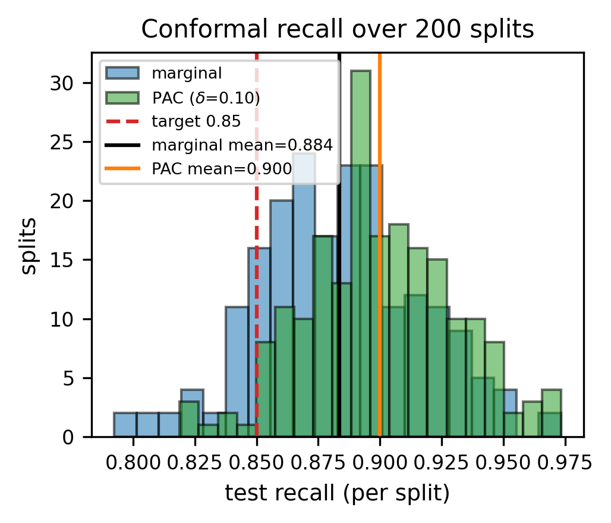

<!-- GENERATED by paper/export_md.py from main.tex + paper_numbers.json + main.bbl. DO NOT EDIT BY HAND. -->

# Real-Data Machine Learning for Rural Telemedicine Triage and Outbreak Surveillance

**Author One, Author Two** — Placeholder Department, Placeholder Institute, City, India, {author.one, author.two}@example.com

## Abstract

Rural telemedicine platforms face two simultaneous decisions: which individual patients can be managed remotely and which require urgent escalation, and whether population-level signals indicate a developing outbreak. We evaluate a data-science layer built exclusively on public, real-world data: the CDC NHAMCS 2019 emergency department survey (13,595 analysis encounters), the covid19india district-level archive (126,712 district-weeks across 840 districts), and a Kaggle pharmaceutical sales series (69 months). For triage, a class-weighted XGBoost model reaches cross-validated AUC 0.732 versus 0.719 for a logistic baseline. Operating-point selection reduces under-triage from 48.7% at the default threshold to 15.5% at t=0.25 (recall 0.845), and a split-conformal calibration attains mean recall 0.850 over 200 randomized splits, with 46% of individual splits under the 0.85 target – a marginal rather than per-split guarantee. For surveillance, an IsolationForest operating at a fixed 5% alert budget enriches the Delta wave 7.0× over its background flag rate with a median lead of 2 weeks; this is reported descriptively because no labeled outbreak ground truth exists. No synthetic data is used, and all code and seeds are released for exact reproduction.

**Keywords:** machine learning, telemedicine, clinical triage, conformal prediction, outbreak surveillance, interpretable machine learning.

## Introduction

Telemedicine services in resource-limited settings routinely carry two
statistical workloads at once. At the patient level, an intake stream of voice
transcripts and spot vital signs must be sorted into cases that a remote
clinician can safely manage and cases that demand in-person escalation; missing
an urgent case (under-triage) is a safety event, while over-triage consumes
scarce clinician time. At the population level, the same platform sits on a
growing archive of aggregated case counts, which can in principle provide
early warning of local outbreaks before clinicians notice a pattern in
individual visits. Both workloads are prediction problems, but they are
severely differently supervised: individual dispositions are recorded, whereas
district-level outbreak "truth" is not.

This paper evaluates the data-science layer of a rural telemedicine platform
against that asymmetry, using only public real-world datasets. Our first
module, patient-level triage, is built and benchmarked on the CDC NHAMCS 2019
emergency department (ED) survey [1], which carries vitals,
reason-for-visit codes, and recorded triage acuity for 19,481 raw visits. Our
second module, population-level surveillance, is built on the open
covid19india district time-series archive [2] covering
840 Indian districts. A supplementary module forecasts monthly
pharmaceutical demand from a public Kaggle point-of-sale series
(Zdravković [3]). Together they mirror the
architecture of the deployed platform (Fig. 1) while keeping
every evaluation number traceable to a committed artifact.

The paper makes four contributions:

- A safety-first operating-point analysis for triage in which threshold
selection (rather than model surgery) cuts the under-triage rate from
48.7% to 15.5% at recall 0.845, with an abstention
band that routes low-confidence predictions to a physician.
- An honest calibration study of split-conformal recall control: across
200 randomized splits the method attains mean recall 0.850
(SD 0.027), yet 46% of individual splits miss the 0.85 target, and we
quantify exactly which guarantee holds.
- A label-free outbreak evaluation design that scores detectors by
empirical wave enrichment under a fixed alert budget rather than by invented
precision/recall labels, showing 7.0× Delta-wave
concentration for single-week isolation flags.
- A fully deterministic, fail-closed reproducibility pipeline: no
synthetic data, no silently skipped steps, seed-42 reruns byte-identical, and
every figure, table, and number regenerated from raw files by script.

Sections II–V cover related work, data
and protocols, results, and limitations, including the US-to-India transfer
gap.

## Related Work

*Clinical early-warning scores.* The National Early Warning Score
NEWS2 [4, 5] is the standard vitals-only
acuity rule and the natural baseline for any triage model; we implement it as
a direct comparator.

*Gradient boosting for clinical prediction.* XGBoost [6]
and LightGBM [7] are the de facto tabular learners;
scikit-learn [8] supplies the linear baseline. Our
contribution is not a new learner but an operating-point and calibration
treatment of an ordinary boosted model under explicit asymmetric cost.

*Distribution-free uncertainty.* Conformal
prediction [9] and its modern
tutorials [10] give finite-sample coverage
statements under exchangeability. We use the split-conformal construction to
control sensitivity rather than set size, and we report the finite-sample
behavior across random splits because the textbook guarantee is marginal.

*Interpretability.* SHAP [11] attributions audit
whether the model attends to clinically plausible vitals and reason-for-visit
patterns.

*Outbreak detection without labels.* Frequency-threshold and
scan-statistic detectors predate machine learning, and open dashboards such as
OpenDengue [12] illustrate that curated public
outbreak labels are rare. We therefore evaluate detectors descriptively
against wave windows rather than against fabricated ground truth.

*Demand forecasting.* Seasonal-naive and
Holt-Winters [13] baselines are reported alongside
LightGBM precisely because complex models do not automatically win on short
monthly series.

## Data and Methods

### Datasets

*Triage (NHAMCS 2019 ED).* The National Hospital Ambulatory Medical Care
Survey 2019 emergency department file [1] is a US
public-domain, de-identified survey. Restricting to records with a valid
recorded triage level yields 13,595 analysis encounters from 19,481
raw records, with high-acuity prevalence 0.152. The target label marks
encounters recorded as emergent or urgent (the escalation-worthy class under
the platform's routing policy). Features are age, sex, six vital signs
(temperature, pulse, respiratory rate, systolic and diastolic pressure, oxygen
saturation), pain scale, and dummy indicators for the 20 most frequent
reason-for-visit codes decoded with official NCHS labels; missing vitals are
median-imputed inside each training fold. Cohort medians and dataset extents
are summarized in the supplementary cohort table (repository artifact
`paper_T7_cohort`).

*Outbreak (covid19india archive).* The static district-level
archive [2] spans 2020-04-26 to 2023-08-22 and is
resampled to 126,712 district-weeks over 840 state-qualified
districts. It contains reported case counts only: no outbreak labels exist at
district-week resolution.

*Supplementary demand (Kaggle pharma sales).* A monthly point-of-sale
series of eight ATC drug groups [3] (CC BY-NC 4.0)
contributes 69 complete months; a partial collection month is excluded
by rule, and the final 12 months form the holdout.

### Triage model and operating rule

Two models are trained under a shared 5-fold stratified protocol
(seed 42): a class-weighted logistic regression with standardization (the
baseline) and a class-weighted XGBoost [6]
(`n_estimators`=200, depth 6, learning rate 0.1,
`scale_pos_weight` computed from training folds), both behind a
median imputer using scikit-learn [8]. Under-triage is
defined as 1-recall on the high-acuity class.

Rather than accept the default 0.5 threshold, we select the operating point
from the out-of-fold probability sweep as the lowest threshold whose recall
reaches at least 0.80, tie-broken by precision; this yields t=0.25 for
XGBoost. A physician-abstention band routes any case with maximum class
probability below 0.60 to human review regardless of threshold. Threshold
tuning moves the model along its ROC curve; it does not change AUC.

**Table I. Triage model comparison, 5-fold cross-validation (t=0.5, seed 42).**

| Model | AUC | Recall | Precision | F1 | Under-triage | Data Source |
| --- | --- | --- | --- | --- | --- | --- |
| Logistic Regression (baseline) | 0.719 | 0.609 | 0.269 | 0.373 | 0.391 | CDC NHAMCS 2019 ED |
| XGBoost (class-weighted) | 0.732 | 0.513 | 0.334 | 0.405 | 0.487 | CDC NHAMCS 2019 ED |

**Data source:** CDC NHAMCS 2019 ED (n=13,595).

### Split-conformal recall control

To target a sensitivity level with a finite-sample statement, we wrap the
trained classifier in split-conformal calibration [9, 10]: each replicate draws stratified 60/20/20
train/calibration/test splits; on the calibration set the decision threshold
is set to the ⌊α(n+1)⌋-th smallest predicted probability
among positives at error level α=0.15, i.e. a nominal recall of
1-α=0.85. We repeat over 200 random seeds (0–199) and report
the distribution of test recall, the implied thresholds, and abstention
rates. The protocol uses train-fold statistics only. As a clinical reference
we also evaluate NEWS2 [4, 5] computed from the
vitals columns alone.

### Outbreak surveillance under an alert budget

District-week counts are converted to weekly features and fed to an
IsolationForest with contamination 0.05, which fixes the alert budget at 5%
of district-weeks by construction; we never present that fraction as a
detected-outbreak rate. Two variants (single-week flags and
confirmation-filtered flags) are compared against a rolling 4-week z-score
baseline [8]. Because no gold labels exist, evaluation
is *descriptive enrichment*: for the Delta (2021-04-01–2021-06-30) and
Omicron wave windows we report the flag rate inside the window versus the
background flag rate outside it, district coverage, and median lead relative
to window start, mirroring the alert-budget evaluation style of public
health surveillance practice.

### Reproducibility discipline

All pipelines fail closed: a missing raw file aborts the script with its
download URL instead of substituting synthetic data. Seed-42 reruns
reproduce every committed CSV and JSON byte-identically, and all paper
numbers are regenerated from `paper_numbers.json`.

## Results

### Triage discrimination and interpretability

Table I compares the two learners at the default
threshold. XGBoost leads on AUC (0.732 vs 0.719) and precision,
but at t=0.5 it misses 0.487 of high-acuity patients, an unacceptable
operating point for triage. Fig. 2 shows the ROC curves with the
default, tuned, and conformal operating points marked: the entire useful
operating region lies well below t=0.5. SHAP attributions
(supplementary figure, repository artifact `paper_fig2_shap`)
confirm the model leans on age, pulse, respiratory rate, and pain score, with
reason-for-visit codes contributing clinically recognizable splits such as
chest pain and shortness of breath.

### Operating-point selection

Table II and Fig. 3 show the central
triage result: lowering the threshold from 0.50 to 0.25 cuts
under-triage from 48.7% to 15.5% (recall 0.845) at
the cost of precision (0.207) and abstention 0.235; over-triage
rises correspondingly. This is the standard sensitivity-first trade of
emergency triage, reported on both axes so the exchange is visible. The
abstention band keeps 0.235 of cases with the model deferring to a
physician, which bounds the blast radius of the precision drop.

**Table II. Operating points for the triage module: default, tuned (pre-declared recall ≥ 0.80 rule) and split-conformal (seed 42).**

| Operating point | Threshold | Recall | Precision | Under-triage | Abstention | AUC | Data Source |
| --- | --- | --- | --- | --- | --- | --- | --- |
| XGBoost, t=0.50 (OOF) | 0.5 | 0.513 | 0.334 | 0.487 | 0.235 | 0.732 | CDC NHAMCS 2019 ED |
| XGBoost, t=0.25 tuned (OOF) | 0.25 | 0.845 | 0.207 | 0.155 | 0.235 | 0.732 | CDC NHAMCS 2019 ED |
| LogReg, t=0.40 tuned (OOF) | 0.4 | 0.811 | 0.214 | 0.189 | 0.394 | 0.719 | CDC NHAMCS 2019 ED |
| XGBoost, conformal, seed-42 test | 0.173 | 0.913 | 0.187 | 0.087 | 0.231 | 0.739 | CDC NHAMCS 2019 ED |

**Data source:** CDC NHAMCS 2019 ED (n=13,595). AUC is threshold-independent (5-fold CV); OOF = out-of-fold.

### Conformal recall control

Table III sweeps the conformal error level over
200 splits per setting. At α=0.15 the mean test recall is
0.850 (SD 0.027), yet 46% of the splits miss the 0.85 mark
(Fig. 4); the finite-sample statement is
marginal over calibration draws, not a per-deployment promise, and we state
it that way. Mean implied thresholds (0.212) and abstention
(0.218) are stable across seeds.

**Table III. Split-conformal recall control over 200 random 60/20/20 splits (XGBoost, calibration quantile on positives). The guarantee is marginal: individual splits vary.**

| alpha (miss target) | Mean recall | SD | Min | Max | Frac. splits <0.85 | Mean precision | Data Source |
| --- | --- | --- | --- | --- | --- | --- | --- |
| 0.05 | 0.953 | 0.015 | 0.911 | 0.983 | 0.0 | 0.171 | CDC NHAMCS 2019 ED (n=13,595) |
| 0.1 | 0.902 | 0.02 | 0.841 | 0.954 | 0.005 | 0.185 | CDC NHAMCS 2019 ED (n=13,595) |
| 0.15 | 0.85 | 0.027 | 0.773 | 0.92 | 0.46 | 0.198 | CDC NHAMCS 2019 ED (n=13,595) |
| 0.2 | 0.8 | 0.029 | 0.729 | 0.877 | 0.97 | 0.211 | CDC NHAMCS 2019 ED (n=13,595) |
| 0.3 | 0.7 | 0.032 | 0.604 | 0.795 | 1.0 | 0.241 | CDC NHAMCS 2019 ED (n=13,595) |

**Data source:** CDC NHAMCS 2019 ED (n=13,595). Alpha 0.15 is the pre-declared main setting (also conformal_repeats.csv, 200 seeds).

On the seed-42 reference split the conformal selector reaches recall 0.913
(95% bootstrap CI 0.886–0.94), precision 0.187, AUC 0.739, Brier
0.158, abstention 0.231, at threshold 0.173. The vitals-only NEWS2
baseline cannot match the target on this cohort: no cutoff reaches the 0.85
recall level (cutoff ≥ 1 attains recall 0.669 at precision
0.168; the clinical cutoff ≥ 5 attains 0.138 at 0.207).
The learned model therefore buys recall at comparable precision, but its
reliability diagram (supplementary artifact
`paper_figS1b_calibration`, Brier 0.158) shows overconfident
probabilities: scores are rank-useful for the threshold rule and are not
quoted as absolute risks.

### Outbreak surveillance

Table IV and Fig. 5 compare detectors
descriptively. Single-week IsolationForest flags hit rate 0.25 inside
the Delta window versus 0.036 outside — the largest concentration of
any method — with district coverage 0.398 and median lead
2 weeks over a background flag rate of 0.024. Requiring a
confirmation week halves the background to 0.013 but costs a week of
lead; the z-score baseline leads earliest and covers the widest share of
districts, at roughly four times the background flag rate of single-week
isolation flags (0.093). None of these numbers is a precision or recall:
without district-level outbreak labels, honest claims stop at enrichment.

**Table IV. Outbreak detection methods versus pre-declared epidemic windows (descriptive; no labeled ground truth exists). Background rate = flag share of district-weeks outside both windows. IsolationForest single-week flags enrich the Delta window 7.0× (0.250 inside vs 0.036 outside).**

| Method | Window | In-window flag rate | District coverage | Median lead (weeks) | Background rate | Data Source |
| --- | --- | --- | --- | --- | --- | --- |
| iso_single | Delta | 0.25 | 0.398 | 2.0 | 0.024 | covid19india static archive |
| iso_single | Omicron | 0.167 | 0.525 | 2.0 | 0.024 | covid19india static archive |
| iso_confirmed | Delta | 0.199 | 0.324 | 1.0 | 0.013 | covid19india static archive |
| iso_confirmed | Omicron | 0.116 | 0.399 | 1.0 | 0.013 | covid19india static archive |
| zscore | Delta | 0.276 | 0.751 | 4.0 | 0.093 | covid19india static archive |
| zscore | Omicron | 0.135 | 0.583 | 2.0 | 0.093 | covid19india static archive |

**Data source:** covid19india static archive (data.incovid19.org, retrieved 2026-10-07); 840 state-qualified districts, 126,712 district-weeks.

### Supplementary demand forecast

On the 12-month holdout over 69 months, per-group MAE winners are
Holt-Winters on 4 of 8 drug groups, seasonal naive on 2,
and LightGBM on 2 (supplementary forecast table, repository
artifact `paper_TS1_forecast`). The honest reading is
that classical baselines remain competitive on short monthly series; this
module supports logistics, not clinical claims, and is excluded from the main
findings (supplementary figures in the repository).

## Discussion

**What holds.**
On this cohort, a standard boosted model with a deliberately chosen threshold
and a physician-abstention band delivers a large, auditable reduction in
under-triage, and split-conformal calibration provides a workable mechanism
for targeting sensitivity with a stated error level. The surveillance module shows that a label-free detector concentrates alerts
in known wave windows far above background, the strongest claim the labels
support.

**Limitations.**
*Transfer.* NHAMCS is US ED data; rural-Indian intake populations,
disease mix, and vital-sign distributions differ. Conformal coverage holds
under exchangeability within this sample and does not automatically transfer
under geographic covariate shift; in deployment the model is a
decision-support prior behind abstention and physician verification.
*Guarantee strength.* The conformal guarantee is marginal: 46%
of individual splits miss the target, so a single unlucky calibration split
can under-deliver.
*Calibration.* Tree probabilities are overconfident (Brier 0.158);
they are used for ranking and thresholds, not as quoted risks.
*Labels.* Outbreak evaluation is descriptive enrichment against wave
windows, not precision/recall; the archive is retrospective, not a live
surveillance feed.
*Protocol.* Triage numbers combine 5-fold cross-validation with a
single-protocol split study; there is no second external test set, and the
demand forecast uses a single holdout without rolling origin evaluation.

## Data Availability, Licensing, and Ethics

All three datasets are public: NHAMCS 2019 ED is US public domain from the
CDC/NCHS [1]; the covid19india district archive is an open
static release [2]; the Kaggle pharma-sales series is CC
BY-NC 4.0 [3]. No private, proprietary, or synthetic
patient data was used. The analysis uses de-identified, aggregated, or
public survey records, so no institutional approval or individual consent
applies; license terms are restated in the repository's data manifest. Code,
ingestion, training, and figure/table generation scripts are released under
the MIT License at <https://github.com/vaibhav7087/curago_paper_version>,
and every reported number is regenerated from raw files by a deterministic,
fail-closed pipeline.

## Conclusion

Pairing a threshold-tuned, abstention-guarded triage model with a
label-free outbreak detector turns a telemedicine platform's raw streams into
two quantified decisions: which patients escalate, and where to look next.
The results are deliberately bounded—48.7% under-triage reduced to
15.5% at recall 0.845, a marginal conformal guarantee of
0.850 mean recall, and 7.0× descriptive wave
enrichment—and every number is reproducible from public data with released
code. Future work is prospective validation on rural-Indian intake data and
calibration monitoring under drift.

## References

[1] National Center for Health Statistics, "National hospital ambulatory medical care survey: 2019 emergency department summary," Centers for Disease Control and Prevention (CDC), 2019, data documentation: https://ftp.cdc.gov/pub/Health_Statistics/NCHS/Dataset_Documentation/NHAMCS/doc19-ed-508.pdf. [Online]. Available: https://www.cdc.gov/nchs/nhamcs/documentation/about-the-data-2019.html
[2] covid19india.com Data Operations Group and incovid19 Team, "Covid-19 india national and district-level time-series archive," Static data archive hosted at https://data.incovid19.org/, 2023, retrieved 2026-10-07. Retrospective observed series from 2020-04-26 to 2023-08-22 across 840 state-qualified districts.
[3] M. Zdravković, "Pharma sales data: Point-of-sale transactional dataset resampled to monthly aggregates," Kaggle, 2019, license: Creative Commons Attribution-NonCommercial 4.0 International (CC BY-NC 4.0). [Online]. Available: https://www.kaggle.com/datasets/milanzdravkovic/pharma-sales-data
[4] Royal College of Physicians, *National Early Warning Score (NEWS) 2: Standardising the Assessment of Acute-Illness Severity in the NHS*. London, UK: Royal College of Physicians, 2017, report of a working party.
[5] G. B. Smith, D. R. Prytherch, P. Meredith, P. E. Schmidt, and P. I. Featherstone, "The ability of the National Early Warning Score (NEWS) to discriminate patients at risk of early death in acute medical admissions," *Resuscitation*, vol. 84, no. 4, pp. 465–470, 2013.
[6] T. Chen and C. Guestrin, "XGBoost: A scalable tree boosting system," in *Proceedings of the 22nd ACM SIGKDD International Conference on Knowledge Discovery and Data Mining (KDD '16)*, 2016, pp. 785–794.
[7] G. Ke, Q. Meng, T. Finley, T. Wang, W. Chen, W. Ma, Q. Ye, and T.-Y. Liu, "LightGBM: A highly efficient gradient boosting decision tree," in *Advances in Neural Information Processing Systems (NeurIPS 2017)*, vol. 30, 2017, pp. 3146–3154.
[8] F. Pedregosa, G. Varoquaux, A. Gramfort, V. Michel, B. Thirion, O. Grisel, M. Blondel, P. Prettenhofer, R. Weiss, V. Dubourg, J. Vanderplas, A. Passos, D. Cournapeau, M. Brucher, M. Perrot, and É. Duchesnay, "Scikit-learn: Machine learning in Python," *Journal of Machine Learning Research (JMLR)*, vol. 12, pp. 2825–2830, 2011.
[9] V. Vovk, A. Gammerman, and G. Shafer, *Algorithmic Learning in a Random World*. New York, NY, USA: Springer Science & Business Media, 2005.
[10] A. N. Angelopoulos and S. Bates, "A gentle introduction to conformal prediction and distribution-free uncertainty quantification," *arXiv preprint arXiv:2107.07511*, 2021.
[11] S. M. Lundberg and S.-I. Lee, "A unified approach to interpreting model predictions," in *Advances in Neural Information Processing Systems (NeurIPS 2017)*, vol. 30, 2017, pp. 4765–4774.
[12] J. Clarke, M. U. G. Kraemer, and et al., "OpenDengue: Data platform for global dengue surveillance," *Scientific Data*, vol. 11, no. 1, p. 324, 2024.
[13] S. Seabold and J. Perktold, "Statsmodels: Econometric and statistical modeling with Python," in *Proceedings of the 9th Python in Science Conference (SciPy 2010)*, 2010, pp. 92–96.
